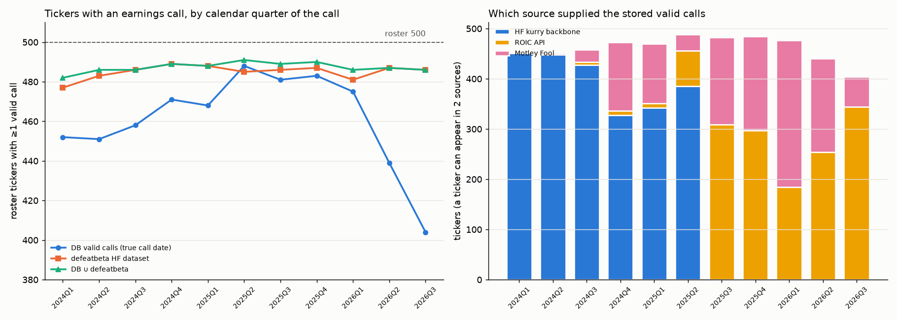
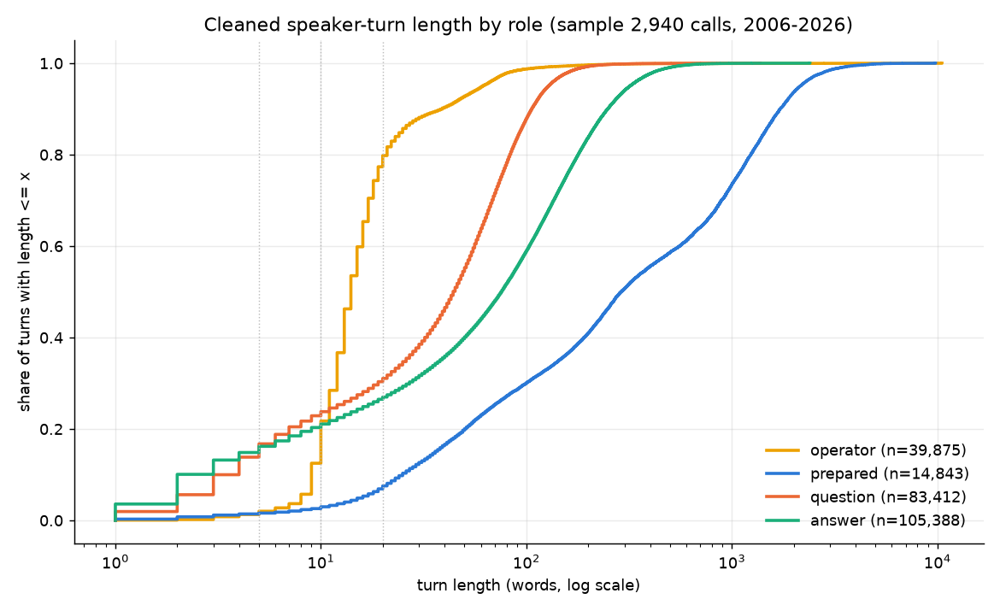
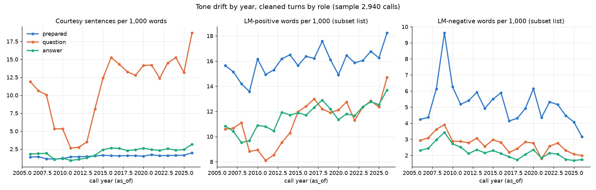

# Research — earnings-call transcript extraction gaps

**Date**: 2026-10-01 · **Repo**: `dev` @ `71a9ecd` · **Stage**: harness-spec research (no product code changed)
**Inputs**: `earnings_call_sections` (live `pea_db`), Airflow log of 2026-10-01 03:00 UTC, ROIC API (live), defeatbeta HF dataset (live), vendor docs.
**Evidence**: `_out/coverage_by_quarter.csv`, `_out/ec_coverage_by_quarter.png`, `_cache/roic_*.json`, `_scripts/*.py`.

## 1. Request and research questions

The user asked, about `src/data_extract/utils/behavioral/fetch_earnings_calls.py`:

1. Why do so many ROIC transcripts get rejected as "missing sections: qa / prepared_remarks"? Is it a tagging/split problem or a source problem?
2. Why do so many tickers seem to have no earnings call since mid-2025: no source, or wrong extraction?
3. Show, per quarter since 2024Q1, how many tickers have a call (a chart).
4. What is the best free online source of good-quality transcripts for the 491-ticker universe?
5. Does Alpha Vantage (free: 25 req/day) cover the ROIC gaps? Should it replace Motley Fool?

## 2. Current architecture (end to end)

| Stage | Code | What it does |
|---|---|---|
| HF backbone | `fetch_hf_transcripts.py` | One 1.74 GB parquet `kurry/sp500_earnings_transcripts`; deep history, last calls ~2025Q2 (calendar). |
| Gap | `utils_missing_quarters.py::missing_quarters_by_ticker` | `required = [HF latest label + 1 .. released]` minus quality-valid quarters on disk/DB, plus stored malformed quarters. |
| ROIC | `fetch_roic_transcripts.py` | LIST, then TRANSCRIPT per missing quarter, 12.5 s pause; split via `split_prepared_qa`; a quarter failing the gate is **not stored** and "left for Fool". |
| Fool | `fetch_earnings_calls.py::build_transcript_index_by_ticker` + `download_transcripts` | One quote page per gap ticker; links ≥ gap start added to `transcript_index.json`; HTML cached; `as_of = call_date` parsed from the **URL date**. |
| Ingest | `ingest_earnings_calls` | Parse HTML (`transcript-content`/`article-body` div); a malformed call is stored as a null-producing marker. |
| Split | `utils_split_qa.py::split_prepared_qa` | Prose starts at the **first line beginning with `Operator`**; Q&A = first `_QA_MARKER` hit after char 2000, else anywhere, else the 2nd Operator line; a section is kept only when > 300 chars. |
| Gate | `src/utils/text_metrics.py::assess_earnings_call_sections` | Valid ⇔ both `prepared_remarks` and `qa` have > 0 cleaned words and ≥ 100 words in total. |

Table `earnings_call_sections`: PK `(ticker, quarter, tag)`, tags `full / prepared_remarks / qa / participants`; `quarter` is a **fiscal** label `YYYYQn` (verified: 2025Q1 spans `as_of` 2024-05-16 → 2026-04-29); `as_of` is a DATE.

## 3. Observed behaviour (measured)

### 3.1 Coverage per calendar quarter of the call (Q3)

Roster = 500 `sp500_tickers`. "Valid" = `prepared_remarks` > 300 chars and `qa` > 300 chars. The true call date comes from the transcript's own `DATE …` line for Fool rows (938 of 1,231 parsed) and from `as_of` otherwise.

| Calendar quarter | DB valid (true date) | HF | ROIC | Fool | defeatbeta | DB gap | gap filled by defeatbeta | DB ∪ defeatbeta |
|---|---|---|---|---|---|---|---|---|
| 2024Q1 | 452 | 451 | 0 | 1 | 477 | 48 | 30 | 482 |
| 2024Q2 | 451 | 448 | 0 | 3 | 483 | 49 | 35 | 486 |
| 2024Q3 | 458 | 428 | 5 | 25 | 486 | 42 | 28 | 486 |
| 2024Q4 | 471 | 328 | 8 | 137 | 489 | 29 | 18 | 489 |
| 2025Q1 | 468 | 342 | 9 | 119 | 488 | 32 | 20 | 488 |
| 2025Q2 | 488 | 385 | 71 | 32 | 485 | 12 | 3 | 491 |
| 2025Q3 | 481 | 0 | 309 | 173 | 486 | 19 | 8 | 489 |
| 2025Q4 | 483 | 0 | 297 | 187 | 487 | 17 | 7 | 490 |
| 2026Q1 | 475 | 0 | 184 | 293 | 481 | 25 | 11 | 486 |
| **2026Q2** | **439** | 0 | 254 | 186 | 487 | **61** | 48 | 487 |
| **2026Q3** | **404** | 0 | 344 | 60 | 486 | **96** | 82 | 486 |

Findings:

- **No mid-2025 cliff in the stored table.** 2025Q2 to 2026Q1 sit at 475–488 tickers. The cliff is **2026Q2 (439) and 2026Q3 (404)**.
- Grouping by the fiscal `quarter` label makes everything look ~491 per quarter (it mixes calendar periods and counts malformed markers). That label view is misleading for diagnosis.
- A free source (defeatbeta, §4) holds **481–489** roster tickers in *every* quarter. The DB ∪ defeatbeta ceiling is 482–491.

### 3.2 Why tickers go missing recently (Q2): the gap definition, not the source

`_missing_for` caps `required` at `released[tk]`. That is the **calendar** quarter of the latest `earnings_surprises.earnings_date` minus 45 days. It then compares that cap with **fiscal** labels stored by HF, ROIC and Fool. For an off-calendar fiscal year the fiscal label runs 1–3 quarters ahead of the calendar label, so the newest calls are never "required".

Worked example: MSFT reported on 2026-07-29. 2026-07-29 − 45 d falls in calendar 2026Q2. MSFT already has fiscal `2026Q2` (the January call), so its April and July calls are never requested.

Measured (`_scripts/fiscal_check.py`): among roster tickers with no valid call dated in the quarter, the gap logic considers the ticker **complete** for:

| Quarter | Missing tickers | Logic thinks complete | …of which off-calendar FY |
|---|---|---|---|
| 2026Q2 | 59 | **48** | 43 |
| 2026Q3 | 96 | **69** | 68 |

Examples: MSFT, NVDA, CRM, CRWD, CSCO, DIS, ADP, ADSK, AMAT, FDX, INTU, KLAC, LRCX, MDT, ACN, PG, PGR.

The fiscal offset (fiscal label − calendar label of report − 45 d) across the roster is: 0 for 392 tickers, +1 for 34, +2 for 38, +3 for 20, −1 for 12. That gives **92 off-calendar names** exposed to this defect.

The defect is older than 2026; it shows now because the HF backbone (whose rows arrive without the gap logic) ends at 2025Q2. From 2025Q3 on, every call must pass through the gap logic. Fool partly masked the defect, because its quote page adds *all* links ≥ the gap start, not only the required ones.

### 3.3 Why ROIC calls are "malformed" (Q1): mostly the splitter

Fifteen raw ROIC payloads were fetched (`_cache/roic_*.json`): the 3 from the Airflow log plus 12 calendar-FY 2026Q2 calls that the gap logic *does* request and that are still missing.

| Outcome | Calls | Cause |
|---|---|---|
| Splitter failure | **7**: PLTR 24Q4, PNW 24Q4, AXON, JNJ, NOW, UDR, WST | See below |
| Genuine structure | 2: PSKY 25Q2 (no Q&A, mid-merger), COIN (Q&A only after an ~900-char intro) | Call shape |
| Valid now | 2: GEHC, VLTO | Published or fixed after the DAG run |
| No payload | 4: AEE, LYV, MPC, SRE | Absent from ROIC or throttled (HTTP 429 seen) — not distinguished |

Splitter failure modes (all from `split_prepared_qa`):

1. **Prose anchored on the first `Operator` line.** When IR opens the call (PLTR, PNW) or the operator never speaks (AXON), everything before that line is discarded. PLTR has its first Operator line at char 45,546 of 47,020, so Q&A is lost. PNW loses its prepared remarks. AXON has zero Operator lines and zero markers.
2. **Intro preview taken as the hand-off.** "[Operator Instructions]" or "…until the question-and-answer session" appears in the first ~200 chars. With no other marker after char 2000, the fallback search hits the preview, so prepared remarks become ≤ 300 chars and are dropped (JNJ, UDR, PSKY).
3. **IR-moderated Q&A** with no operator hand-off phrase (NOW, WST). Q&A is never found, so everything becomes prepared remarks.

The same defect also **passes the gate silently**. Among stored "valid" calls dated ≥ 2024:

| Source | Calls | prepared < 10 % of full | qa < 10 % of full | prepared + qa < 60 % of full |
|---|---|---|---|---|
| ROIC | 1,513 | 104 | 5 | 15 |
| Fool | 1,231 | **590** | 42 | **487** |
| HF | 2,429 | 169 | 7 | 20 |

The Fool examples show two distinct defects:

- **WELL 2025Q4.** The first `Operator` line is at char 38,934, where Q&A starts. The stored "prepared_remarks" (3.5k) is actually the first Q&A exchange, and the real ~35k characters of prepared remarks are dropped.
- **ADP 2026Q3.** Fool lists "Operator" inside CALL PARTICIPANTS, so `prepared_remarks` starts with Fool's **editorial TAKEAWAYS / RISKS / SUMMARY** block — non-management text that then feeds the tone and embedding features.

Operational cost: a rejected ROIC call is not stored, so it is re-listed and re-fetched on **every** run (2 requests × 12.5 s). The 2026-10-01 log shows the ROIC loop at 140 tickers, ~15–20 s per ticker.

### 3.4 Fool `as_of` is the publication date, not the call date

Motley Fool re-publishes old transcripts under new URL dates; `_parse_link` stores the URL date as `as_of`.

- Of 1,231 Fool calls (≥ 2023-06), **148** have `as_of` > 7 days after the in-body call date, **104** more than 45 days, **61** more than 180 days. Median lag of the late ones: 163 days.
- Examples: AES 2024Q3 (call 2024-11-01, `as_of` 2026-05-13, +558 d); IBM 2024Q3 (+546 d); ADP 2025Q1 (+546 d); GE 2025Q1/Q2/Q3 all `as_of` 2026-01-22.
- Effect: the lag is never earlier than the truth, so there is no look-ahead, but a stale call is presented to features as fresh news. It also creates 1–3 extra calls per ticker in a calendar quarter (`db_dup_calls`; e.g. ESS has 4 calls dated in 2026Q2).

### 3.5 Fool coverage of the gap (Q5 context)

- Fool supplied 60–293 tickers per quarter since 2024Q4. It is the sole source for many 2026Q1 calls (293), so it is not "failing" overall.
- In the 2026-10-01 run, Fool discovery added **+0 links for 139 gap tickers**. That is consistent with §3.2/§3.3: what remains in the gap is mostly calls ROIC returned but our splitter rejected (Fool already holds them or the same split fails), plus names with no quote page (VMC, YUM, HCA).
- The Airflow container uses its own `data/call_transcripts` (the log path is `/opt/…/project/data`). The local repo cache holds only 455 HTML / 472 index links, versus 1,239 Fool calls in the DB.

### 3.6 Tickers with no call anywhere

- Never in the DB: ED, ERIE, BRK-B, EXPD, NVR, FDXF.
- Missing from both DB and defeatbeta in 2026Q3: ACN, AES, BRK-B, ED, EXPD, FDX, FDXF, KVUE, L, MKC, NKE, NVR, TECH, VMRK. (ACN and NKE reported on 2026-10-01; FDXF is a new listing; BRK-B, NVR and EXPD hold no calls.)

## 4. External sources (Q4, Q5) — accessed 2026-10-01

| Source | Free full text | Limits | S&P 500 coverage | Recency | Structure | Terms |
|---|---|---|---|---|---|---|
| **defeatbeta/yahoo-finance-data** (HF) | Yes — VERIFIED (live read) | None; one ~2.27 GB parquet `stock_earning_call_transcripts`, rewritten on update | **481–489 roster tickers per calendar quarter, 2024Q1–2026Q3** — VERIFIED vs our roster | ~1 day (spec.json updated 2026-10-01; latest call 2026-09-30) | `transcripts[{paragraph_number, speaker, content}]`, fiscal labels + `report_date`; no titles or Q&A flag | ODC-BY licence; README says "research and educational purposes"; content sourced from Yahoo |
| Alpha Vantage `EARNINGS_CALL_TRANSCRIPT` | Docs carry no Premium tag — VERIFIED doc; free key **not** live-tested | **25 req/day** (VERIFIED); paid from $49.99/mo (75/min) | not measured | unknown | turns `{speaker, title (CEO/CFO/Analyst/Operator), content, sentiment}`; fiscal `YYYYQn`; 2010Q1+ | free use is "personal, non-commercial" (ToS) |
| ROIC AI (current) | Yes | Free 5/min; pricing page: transcripts "2 quarters" on Free/Individual; Professional $89/mo | — | — | one `content` string, `Name: text` turns | — |
| API Ninjas | No (premium-only) | $39–99/mo | — | — | `is_qa` flag on Business tier | — |
| FMP | No (Ultimate $99/mo) | — | — | — | — | redistribution licence |
| Finnhub | No (premium add-on) — CLAIMED | — | — | — | — | — |
| EarningsCall.biz | AAPL/MSFT only without a key | $60–69/mo | S&P 500 | — | Q&A split on Premium | — |
| earningscalls.dev | 250-char previews only on the free tier | $25–40/mo | — | — | speaker roles | — |
| Other HF datasets (Bose345, idleengine, glopardo, …) | Yes | — | mirrors of kurry, end ~2025Q1 | — | — | — |
| SEC 8-K | Effectively no (44 full-text hits, 2025-07 → 2026-09) | — | — | — | — | — |

Alpha Vantage specifics:

- The demo key works only for IBM 2024Q1. IBM 2025Q4, IBM 2026Q2 and AAPL 2024Q1 return "demo key is for demo purposes only". So **whether AV fills our ROIC gaps is UNVERIFIED**; it needs the user's free key.
- AV IBM 2024Q1 and defeatbeta IBM FY2024Q1 have the same text and the same speaker sequence (AV omits the operator intro). **Inference:** both come from the same upstream vendor (Yahoo's feed), so AV is unlikely to cover calls that defeatbeta lacks.
- Throughput: maintaining ~500 calls per quarter at 25 req/day takes ~20 days of quota per quarter. A 491 × 11-quarter backfill (~5.4k calls) takes ~216 days.

Sources: alphavantage.co/documentation/#transcript, /support/, /premium/, /terms_of_service/; huggingface.co/datasets/defeatbeta/yahoo-finance-data (+ spec.json); roic.ai/pricing; api-ninjas.com/pricing; site.financialmodelingprep.com/pricing-plans; finnhub.io/pricing (search snippet only); github.com/EarningsCall/earningscall-python; earningscalls.dev; efts.sec.gov full-text search. All accessed 2026-10-01.

## 5. Facts, inferences, unknowns

**Facts (measured):**

- The recent cliff is 2026Q2/Q3.
- 48/59 and 69/96 of the missing tickers are silently "complete" under the fiscal/calendar gap mismatch.
- 7 of 11 ROIC payloads with content fail on the splitter.
- 487 Fool calls lose more than 40 % of their text.
- 148 Fool calls carry a publication-date `as_of`.
- defeatbeta covers 481–489 roster tickers in every quarter.

**Inferences:**

- AV shares defeatbeta's upstream. It is therefore no better at filling gaps, and its quota and ToS make it unsuitable as a primary source.
- Replacing Fool with AV would not address the root causes (§3.2, §3.3).
- The HF kurry backbone, ROIC and Fool together are bounded by the same ceiling defeatbeta already reaches.

**Unknowns:**

- Licence fit of defeatbeta and AV ("research/educational", "personal, non-commercial") for the user's use.
- AV free-key coverage of recent quarters.
- Whether AEE/LYV/MPC/SRE are absent from ROIC or were throttled.
- Exact current `missing` dict: the full `missing_quarters_by_ticker` replay did not finish in 40 min locally and was stopped (read-only).
- Quality of defeatbeta speaker segmentation for the Q&A split. It has no titles; the IBM sample looks clean.

## 6. Prior work reconciled

- Memory notes "Earnings-call transcripts" and "Earnings-call sentiment" (Fool chosen as free, Q&A split on the operator hand-off). §3.3 shows the operator anchor is the failing assumption.
- `reports/validate/2026-09-28-earnings-call-features/report.html` covers the downstream features. Not re-measured here.
- Recent commits `1ff327e … 6f06351` added the shared quality gate and malformed-call retry. That retry is what re-fetches splitter failures every run.

## 7. Candidate acceptance boundaries

- Gap definition aligned with the stored labelling (or keyed on call date).
- Speaker-turn-robust split, with a terminal state for calls that genuinely lack a section.
- `as_of` set to the call date.
- Editorial text excluded.
- A bulk free source evaluated against licence.
- Re-split of stored history and invalidation of derived features.

See `01-spec.md`.

## Follow-up research 2026-10-01 — defeatbeta coverage, depth and publication lag

**Scripts**: `_scripts/defeatbeta_depth_lag.py`, `_scripts/defeatbeta_lag_events.py`.
**Inputs**: the dataset's transcript index (columns symbol, fiscal_year, fiscal_quarter, report_date, transcripts_id), `earnings_surprises` from 2026-06-01, and `earnings_call_sections`.

### Snapshot facts (VERIFIED)

- `spec.json` stamps `US/stock_earning_call_transcripts.parquet` at **2026-10-01T04:56Z**; the repo `lastModified` is 07:06Z. `company_tickers.json` carries 2026-09-30T05:12Z, which is consistent with a daily build at about 05:00 UTC.
- The git history is squashed: one commit, "Compact finance data history 2026-10-01". Past versions cannot be diffed, so lag is measured from presence in this snapshot, not from first-seen dates.
- The dataset was created 2024-11-28 and has 118k downloads.
- **Range**: 6,540 symbols, 238,891 calls, `report_date` from **2005-10-11 to 2026-09-30**. Calls dated 2026-09-28/29/30: 11, 6 and 10.
- `report_date` is the **call date**. It matches the ROIC call date exactly for 1,477 of 1,487 shared calls, and within ±1 day for 1,480.

### Coverage and depth for the 500-name roster

- 496 of 500 roster tickers are present, with 33,676 calls. Missing: **BRK-B, ED, EXPD, NVR**.
- First call per ticker:
  - 10th percentile: 2006-02;
  - median: 2007-10;
  - 75th percentile: 2008-02;
  - 90th percentile: 2014-12.
- 47 tickers start after 2015 and 23 after 2020. These are mostly later IPOs and spin-offs; the latest starts 2026-08-05.
- About 4 calls per ticker-year (e.g. 2015: 1,764 calls for 446 tickers).

| Year | defeatbeta tickers | defeatbeta calls | our DB tickers (all sources) | our DB kurry tickers |
|---|---|---|---|---|
| 2006 | 107 | 378 | 79 | 79 |
| 2008 | 401 | 1,529 | 267 | 267 |
| 2010 | 365 | 1,157 | 285 | 285 |
| 2012 | 428 | 1,696 | 313 | 313 |
| 2015 | 446 | 1,764 | 333 | 333 |
| 2018 | 459 | 1,812 | 379 | 379 |
| 2020 | 472 | 1,871 | 449 | 449 |
| 2022 | 479 | 1,906 | 454 | 453 |
| 2024 | 489 | 1,950 | 474 | 463 |
| 2025 | 491 | 1,948 | 492 | 427 |
| 2026 (to 09-30) | 493 | 1,465 | 488 | 0 |

In every year defeatbeta covers **more roster tickers than our kurry backbone** (+113 in 2015, +134 in 2008). Our per-year counts are bounded by what kurry holds for today's roster.

### Publication lag (proxy)

Method: each roster report event since 2026-06-01 comes from `earnings_surprises`. That table often carries a stale estimated date about 7 days before the actual date, so dates within 14 days are collapsed into one event. An event counts as present if a defeatbeta call falls inside its date window ±3 days. Age is measured at the 2026-10-01 04:56Z snapshot.

| Age of call at snapshot | Events | Present | % |
|---|---|---|---|
| ≤ 1 day | 3 | 3 | 100 |
| 1–3 days | 2 | 1 | 50 |
| 3–7 days | 3 | 2 | 67 |
| 7–14 days | 5 | 5 | 100 |
| 14–30 days | 16 | 15 | 94 |
| 30–60 days | 179 | 172 | 96 |
| 60–125 days | 319 | 317 | 99 |
| **Total** | **527** | **515** | **97.7** |

- **Calls held on 2026-09-30 (MU, FDS, JBL) are already in the 05:00Z build of 10-01.** Publication lag is therefore **at most one daily build** (< ~1 day), not weeks.
- The 12 misses are **not lag**. They are names absent at every age:
  - never in the dataset: BRK-B, NVR, EXPD, ED;
  - stopped after 2025, and also absent in our DB and ROIC: L, AES, KVUE (possibly no calls held while under acquisition — UNVERIFIED);
  - PGR (no quarterly call held — UNVERIFIED);
  - TECH 2026-08-12 (a genuine miss);
  - FDXF (new listing);
  - ACN and NKE, whose `earnings_surprises` also lists **2026-10-01** — i.e. most likely reported after the snapshot.
- Limits:
  - One snapshot cannot show calls that arrive *late* (back-filled days afterwards). The 7–30-day buckets show no such pattern.
  - The cadence is inferred from timestamps, not from history.
  - Confirm by re-reading `spec.json` and the newest `report_date` on 2–3 consecutive days, e.g. during the mid-October bank reporting week.

## Follow-up research 2026-10-02 — option B against the aggregation contract

Measured without OpenAI or FinBERT calls. Evidence:

- `_scripts/b_aggregation_contract.py`
- `_scripts/b_diag.py`
- `_scripts/b_followup.py`
- `_out/b_aggregation_contract.txt`
- `_out/b_aggregation_contract_calls.csv`

### What the 12 features consume

| Feature | Inputs | Previous quarter? |
|---|---|---|
| `ec_tone`, `ec_qa_gap`, `ec_uncertainty` | FinBERT cache plus section text, per prepared and qa | no |
| `ec_qa_coherence_mean` | mean over exchanges of cos(question, answers); ≥ 2 exchanges | no |
| `ec_tone_delta`, `ec_length_delta` | consecutive quarter | yes |
| `ec_qa_qq_distance` | mean-pooled **all** qa turns (questions and answers), vs the previous quarter | yes |
| `ec_prep_qq_distance` | mean-pooled prepared turns, vs the previous quarter | yes |
| four `*_vs_hist` | prior-only z-score (5 years, ≥ 4 calls) | prior calls |

Three parts of the user's stated contract are **not** in the code today:

- `ec_qa_qq_distance` pools questions and answers, so it is not a question-to-question distance.
- No feature compares the prepared embedding with the Q&A embedding. The only prepared-vs-Q&A comparison is the tone gap.
- No standalone prepared tone exists.

### Per-call inputs

- **Embedding stage:** a list of turns `{section, tag ∈ question/answer/prepared, person, text, exchange_idx, answer_idx}` plus `as_of`.
- **Sentiment stage:** the two section texts plus `as_of`, which must pass `assess_earnings_call_sections`. The texts are re-read at build time.

### B feasibility on the 585 sample calls

| Path | ≥ 1 question and ≥ 1 answer | ≥ 1 prepared | ≥ 2 exchanges | Question turns by a prepared speaker |
|---|---|---|---|---|
| B1 adapter (render "Speaker: text", keep `split_turns`) | 97.9 % | 99.8 % | 96.9 % | 0 |
| **B2 direct roles** | **99.1 %** | 99.8 % | 97.1 % | 0 |

- B1 loses 3.8 % of turns: `_INLINE_HDR` breaks middle-initial names ("Brice A. Hill", "Dr. Lisa Su") and one-word speaker names.
- Against the legacy embedding turns on 503 date-aligned calls, B2/legacy ratios have median 1.00 for prepared, question, answer and exchange counts.
- The question-person Jaccard median is 1.0.
- Of the 10 worst disagreements, legacy is wrong in 8: it folded the whole Q&A into prepared.

**Role-logic defects common to legacy and B2:**

- **Analyst follow-ups labelled as answers.** 12.1 % of answer turns in legacy and 9.1 % in B2. All come from the `split_turns` position fallback.
- **"Up next, we have X" hand-offs.** The pattern is not recognised, so the call is under-split: 40 of 585 calls, all 13 AXON calls among them.
- **COIN-style IR-read questions.** Not handled.

**Key collision.** 23 of 526 overlapping calls hold a *different* call under the same `(ticker, quarter)` label in legacy. These are dates 6–546 days apart, mostly Fool and kurry mislabels. A full rebuild of the derived rows is required, not a merge.

### Point-in-time timing

- `report_date` is date-only for 585/585 calls, so pre-market and after-close calls cannot be told apart.
- It matches the legacy `as_of` in 489/503 calls; in 12 the legacy date is one day later.
- Whether it is the call date or the press-release date is UNVERIFIED.

Today `_daily_frame` uses `searchsorted(as_of, side="right")`, which already starts at the first session after D. Storing D+1 with the right side lags by two sessions from Monday to Thursday but by one on Fridays and pre-holiday days, which is inconsistent.

**D+1 with `side="left"` reproduces today's sessions in every case.** It needs two companion changes:

- `step_cube_text.py:76`: `refresh_from = min(changed) + BDay(1)` becomes `min(changed)`.
- Validator `earnings_calls.py:387`: `<` becomes `<=`.

### Blast radius of B2

About 80 changed lines in aggregation:

- `_section_calls`, `_yield_call_texts` and `embed_earnings_calls` yield turns.
- `split_turns` steps 2a/2b are extracted into `label_turns(turns, section, …)`.
- `_daily_frame` side, `refresh_from` and the validator change as described above.

Untouched: the KPI math (`build_embedding_kpis`, `_qa_coherence`, `_qq_distance`, `_per_call_kpis`, `_issuer_history_zscore`, `prepare_earnings_call_kpis`, `build_earnings_call_feature_panel`) and the schemas of `earnings_call_sentiment`, `earning_calls_embedding` and `cube_part_text`.

Sentiment and the validator stay untouched if `earnings_call_sections` is kept as **header-free derived section texts** built from the paragraphs.

## Follow-up research 2026-10-02 — text noise in the defeatbeta transcripts

**Question (user)**: before any embedding or sentiment run, what preprocessing is in place, how long is each person's speech, and what noise (empty or one-word turns, names, pleasantries, politeness drift) reaches the models?

**Method**: a stratified sample of 2,940 calls (140 per year, 2006–2026, 473 tickers, seed 20261002) plus SQL over all 2,804,060 paragraphs. Read-only. The role labelling reproduces `label_turns` exactly. Scripts: `_scripts/clean_sample.py`, `_scripts/clean_noise.py`, `_scripts/clean_raw_sql.sql`. Outputs: `_out/clean_summary.txt`, `_out/clean_3_noise_examples.txt`, `_out/clean_*.csv`.

### What is in place

- **Sentiment (FinBERT)**:
  - the input is one prepared-remarks string and one Q&A string per call;
  - courtesy sentences are stripped only at the start and end of each **whole section** (`clean_earnings_call_text`);
  - the Q&A string holds every Q&A turn: operator, analyst and management.
- **Embeddings**:
  - each turn is cleaned (`label_turns`): operator and logistics turns are dropped, courtesy sentences are stripped at both ends of the turn, turns under 25 characters are dropped, and questions under 4 words are dropped.
- **Names**: speaker names never appear in `content` (27 of 250,245 rows). Names spoken inside the text are kept.

### Defect: decimals and abbreviations are broken in every model input

- Both cleaners split sentences on `[^.?!]+[.?!]*` and rejoin with a space, so `3.5%` becomes `3. 5%` and `U.S.` becomes `U. S.`.
- Reproduced: `clean_earnings_call_text("Revenue grew 3.5% in the U.S. to $1.2 billion.")` returns `"Revenue grew 3. 5% in the U. S. to $1. 2 billion."`.
- On the sample: 95,165 broken decimals in the FinBERT input and 95,628 in the embedded turns, with 0 intact; about 18k `U. S.` in each.
- The legacy pipeline used the same cleaner, so the defect predates this work.

### Raw paragraphs (all rows)

- Blank content: 10,147 rows (0.36 %).
- Word quantiles q01/q05/q25/q50/q75/q95/q99: 1/2/13/48/108/323/1,366.
- Short rows: 2.1 % are one word; 9.1 % are 3 words or fewer.
- Most frequent rows: `Thank you.` 35,083; `Good morning.` 12,862; `Yes.` 12,459.

### Cleaned-turn length by role

| Role | Turns | q05 | q50 | q95 | ≤ 1 word | ≤ 10 words | Words in turns < 10 words |
|---|---|---|---|---|---|---|---|
| operator | 39,875 | 8 | 14 | 61 | 0.08 % | 21.7 % | 4.3 % |
| prepared | 14,843 | 16 | 289 | 2,152 | 0.29 % | 3.0 % | 0.02 % |
| question | 83,412 | 2 | 44 | 128 | 1.95 % | 23.8 % | 1.9 % |
| answer | 105,388 | 2 | 76 | 319 | 3.59 % | 21.1 % | 0.66 % |

### Noise, as a share of words

Precision is true hits out of 20 checked by eye.

| Class | FinBERT prepared | FinBERT Q&A | Embedded | Precision |
|---|---|---|---|---|
| analyst text in the Q&A string | — | 26.4 % | (separate turns) | by role |
| operator text in the Q&A string | — | 4.1 % | 0 | by role |
| safe-harbor and IR boilerplate | 5.0 % | — | 5.0 % of prepared | 15/20 |
| participant roster, "joined today by" | 1.5 % | — | 1.4 % of prepared | 19–20/20 |
| speaker-name tokens | 1.2 % | about 0.5 % | 0.4–1.1 % | 18/20 |
| courtesy sentences anywhere | 0.7 % | 3.5 % of questions, 0.8 % of answers | 0.3–0.4 % | 19/20 |
| backchannel turns | — | 0.2–0.7 % | ≤ 0.07 % | 20/20 |
| hedges (`kind of`, `sort of`, `you know`, `I mean`) | — | 0.5–1.2 % | 0.6–1.2 % | 19–20/20 |
| `uh`/`um`, `like`, repeated words, artefacts | < 0.1 % | < 0.1 % | < 0.1 % | — |

- Sentences with no number or finance term: 35 % of FinBERT words; 33 % of embedded words.

### Politeness drift (courtesy sentences per 1,000 words, 2006–10 → 2021–25)

- **Questions**: 8.6 → 13.9, but the change is a step: 2.6–3.5 in 2011–13, then 12–15 from 2015.
- **Answers**: 1.6 → 2.4. **Prepared**: 1.25 → 1.64.
- **Lexicons**: positive words rise in every role (+1.0 to +2.1 per 1,000 words per decade); negative words fall (−0.5 to −0.9). These use a 40-word subset of each Loughran-McDonald list, since the repo has no LM lexicon.
- **Inference (unverified)**: the 2011–15 step in question courtesy looks like a change in transcription style more than in behaviour.

### Candidate rules, simulated

Each rule shows words removed and calls failing the gate, out of 2,880 ok calls.

| Rule | Effect | Gate failures |
|---|---|---|
| R1: Q&A sentiment on management answers only | −30.5 % of Q&A words | 9 |
| R2: courtesy and backchannel sentences removed anywhere | −0.7 % of prepared, −2.1 % of Q&A | 0 |
| R3: fillers only / plus `you know`, `I mean` | about 0 % / −0.35 % | 0 |
| R4: boilerplate sentences removed from prepared remarks | −5.0 % | 0 |
| R5: self-introductions and addressed names removed | −0.1 to −0.2 % | 0 |
| R6: minimum embedded-turn length of 5 / 10 / 15 / 20 words | drops 0.3/4.6/8.5/13.0 % of question turns and 0.4/5.3/9.0/12.2 % of answer turns; ≤ 2.5 % of words | no call loses all its Q&A |
| R7: keep only sentences with numbers or finance terms | −21.6 % of prepared, −43.1 % of Q&A | 1 |
