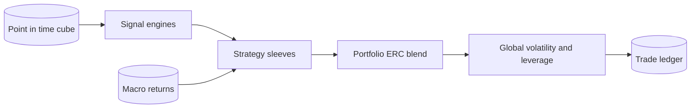

# Modelling, strategies, and portfolio

## Layer boundaries

The three layers have separate contracts:

| Layer | Location | Responsibility |
| --- | --- | --- |
| Signal engines | [src/modelling](../../src/modelling/) | Train cross-sectional ensembles and produce scores; build standalone trend and long-book signals. |
| Strategy sleeves | [src/strategies](../../src/strategies/) | Convert one engine/data contract into a self-contained return stream and tradeable book. |
| Portfolio and execution | [src/portfolio](../../src/portfolio/) | Align sleeves, allocate risk, target portfolio volatility, and persist trade moves. |

A sleeve never depends on another sleeve. The portfolio is the only component that sees and blends all sleeve return streams.

## Sleeve registry

| Sleeve name | Config key | Engine | Role |
| --- | --- | --- | --- |
| `ls_equity` | `strategy_ls` | long/short ensemble | Market-, beta-, and sector-controlled equity alpha, evaluated out of sample. |
| `eq_long_only` | `strategy_eq_long_only` | long/short ensemble | Top-name long-only expression suitable for accounts without shorting. |
| `long_book` | `strategy_long_book` | macro long-book allocation | Long-only multi-asset risk allocation with trend and volatility-regime overlays. |
| `trend_cta` | `strategy_trend` | macro trend engine | Long/short time-series momentum diversifier. |

The registry is [STRATEGY_REGISTRY](../../src/strategies/__init__.py). Sleeve names do not map mechanically to YAML keys, so every implementation declares `config_key`.

## Strategy contract

[base.py](../../src/strategies/base.py) defines the shared objects:

- `PortfolioInputs`: capital, target volatility, start/end dates, fee and spread assumptions, risk-free rate, and analysis flags supplied by the portfolio.
- `StrategyResult`: sleeve name, net daily returns, metrics, positions, trades, extras, and the exact `book_weights` / `book_prices` used to create trades.

The book panels are essential. Portfolio allocation varies through time, and share quantities are a nonlinear function of capital and integer rounding; the ledger must rebuild the blotter from the scaled book rather than multiply already-created trade dollars.

## Long/short training lifecycle

[StepModelling](../../src/modelling/long_short/step_train.py) exposes three behaviors:

| CLI behavior | Method | Contract |
| --- | --- | --- |
| Holdout training | `run()` | Train between configured boundaries, run time-series CV and diagnostics, and produce out-of-sample artifacts. |
| Production refit | `run(full_history=True)` | Fit through the latest eligible cube date with no holdout. Daily prediction reads these artifacts. |
| Latest prediction | `predict_latest(n_dates=...)` | Load production artifacts, score the newest unlabelled cube rows, and write `predictions_latest` without retraining. |

The weekly order is deliberate: holdout training → portfolio backtest → full-history refit. Reversing it makes evaluation and horizon-blend weights in-sample.

## Model completion criteria

A model family is not complete until it has:

1. time-series cross-validation with an embargo that blocks overlapping forward-label windows;
2. validation-row diagnostics, including SHAP for booster members;
3. printed per-fold and aggregate out-of-fold metrics; and
4. persisted artifacts that round-trip through the production prediction path.

ElasticNet members serialize as pickle files. Both standard LightGBM and the configured random-forest family are LightGBM boosters and serialize as text models.

## Cube loading and memory

Training resolves the union of configured family features against the actual cube schema, then loads one target horizon at a time with an explicit projection, labelled-row filter, and float32 downcast. Do not load the full wide cube or all horizons into one frame.

Latest prediction uses a separate feature-only path. The newest cube rows correctly have null forward labels; reusing the labelled training loader would silently drop the observations production needs to score.

## Artifact contract

Model files and metadata live under `context.paths["MODELS_DIR"]`. `metadata.json` is the compatibility contract consumed by the backtest, daily predictor, strategies, and Streamlit app. It records:

- horizons and target type;
- global and family/horizon-resolved feature lists;
- categorical columns;
- actual training boundaries and full-history status; and
- non-negative per-horizon training IC-IR weights for blending.

Per-run diagnostics live under a timestamped diagnostics directory and include horizon KPIs, feature importance, sampled SHAP matrices, plots, and a flat comparison table. Database outputs remain in `predictions`, `cube_signal`, and `predictions_latest`.

## Long/short construction

The [long/short strategy](../../src/strategies/step_ls.py) transforms scores into a constrained book.

- Covariance mode uses shrunk idiosyncratic covariance, reducing duplicated correlated risk. Diagonal mode is inverse variance; full covariance shrinkage toward one becomes the diagonal.
- Dollar, beta, and sector constraints are applied at construction.
- Turnover is controlled through partial movement toward target, a no-trade band, and rebalance frequency.
- Horizon blending uses the training IC-IR weights with configurable shrinkage.
- Whole-share mode solves an integer projection under exposure and gross constraints. Fractional longs can absorb rounding while shorts remain integer.
- Size is neutralized in the target, not in the live book; target construction is therefore responsible for preventing a pure size signal.

Small nominal capital can make integer-share portfolios collapse. Validate position count, gross exposure, neutrality residuals, and turnover under the intended capital.

## Other sleeves

The long-book and trend sleeves read `prices_macro`, which provides a longer multi-asset history than the equity table. They keep their signal and allocation logic inside their own engines and return the same `StrategyResult` shape as equity sleeves.

Any sleeve-specific leverage used to create trades must be represented consistently in its returned book panels. Summary `positions` may intentionally show a different diagnostic view.

## Portfolio blend

[StepPortfolio](../../src/portfolio/step_portfolio.py) reads [portfolio.yml](../../configs/portfolio.yml), builds common inputs, runs configured sleeves, aligns their daily net returns, and calls [blend.py](../../src/portfolio/utils/blend.py).

ERC is the dynamic dollar allocation: covariance-aware equal risk contribution determines sleeve weights, followed by one global volatility target and leverage cap. Inverse-volatility mode is available as a simpler alternative. The portfolio reports sleeve metrics alongside global performance and writes analysis artifacts under the configured output path.

## Strategy moves and ledger

[StepStrategyMoves](../../src/portfolio/step_strategy_moves.py) reuses the portfolio blend, then:

1. multiplies each sleeve's original book weights by time-varying ERC allocation and portfolio leverage;
2. recomputes share-level trades with sleeve prices and trading costs;
3. FIFO-matches entries and exits through [positions.py](../../src/strategies/utils/positions.py); and
4. upserts `strategy` rows so an earlier opening trade can gain exit price and realized P&L when closed.

Scaling an existing blotter is incorrect because capital, weights, prices, and integer constraints vary by date.

## Reviewing a model or strategy change

Review in this order:

1. verify point-in-time inputs and holdout separation;
2. prune or add features using SHAP, coefficient evidence, and fold stability;
3. sanity-check every monotonic direction;
4. compare ensemble predictions, cross-fold IC/IR, turnover, exposures, and realized portfolio behavior—not only mean IC;
5. compare flat per-run KPI artifacts under the same scope; and
6. run the relevant [validation](../guides/validate-a-change.md) with a printed economic conclusion.

Historical benchmark metrics are sanity bars, not acceptance targets; data coverage, labels, and folds can change.

## Related

- [Feature-to-portfolio architecture](../architecture/feature-to-portfolio.md)
- [Modelling module](../modules/modelling.md)
- [Strategies module](../modules/strategies.md)
- [Portfolio module](../modules/portfolio.md)
- [Model training flow](../flows/model-training-and-prediction.md)
- [Portfolio-to-ledger flow](../flows/portfolio-to-trade-ledger.md)
- [Configuration](./configuration.md)
